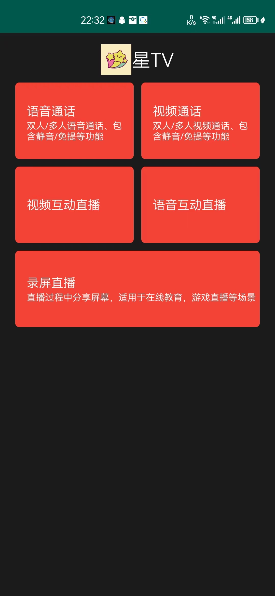
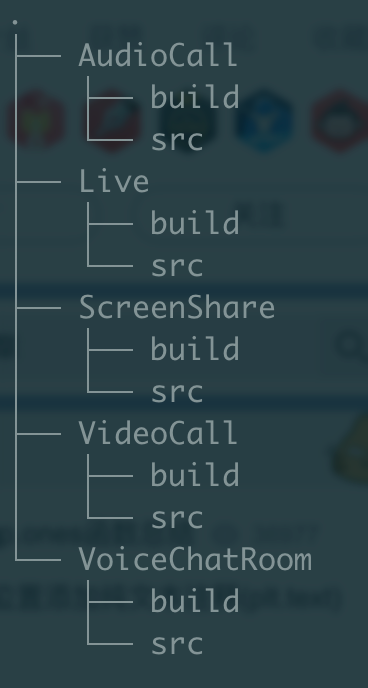
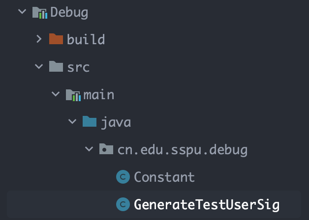

# StarTV: 一个实现基本视频语音通话和视频语音直播以及录屏直播的APP

APP下载：[StarTV.apk](./StarTV.apk)

 
0. 关于本项目

主要有五个功能，语音通话，视频通话，视频互动直播，语音互动直播，录屏直播。

核心功能是创建一个房间，在同一个房间内，你可以与另一个人进行视频或语音通话。

1. 运行配置

- Android Gradle plugin Version：4.2.2
- Gradle Version：6.7.1
- Compile SDK Version: 29
- Gradle JDK: 8

2. 功能结构

 
- 将主要的5个功能分别以Module的形式实现。每个Module具体以腾讯音视频平台提供的SDK实现。

- 主要功能是创建一个房间，输入名字，进入房间可以音视频通话。

3. 腾讯音视频授权
 
   授权文件在Debug中，主要设置GenerateTestUserSig中的SDKAPPID和SECRETKEY。这两个key主要由腾讯音视频平台获得。
